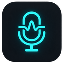
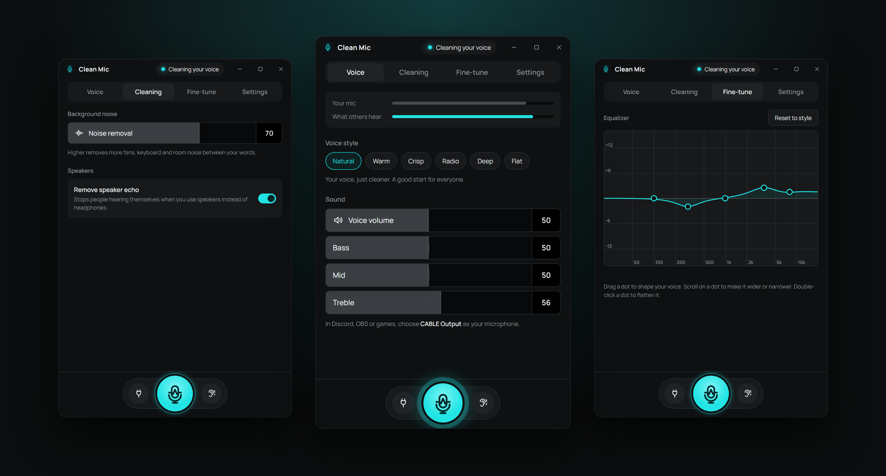
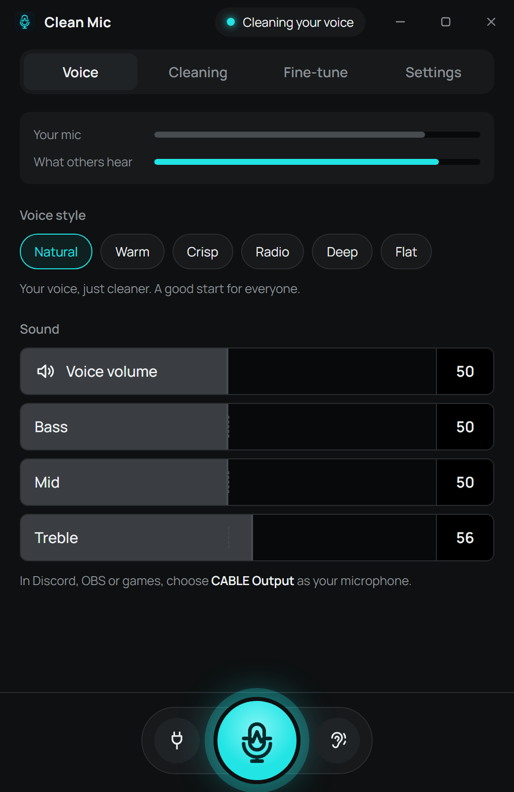
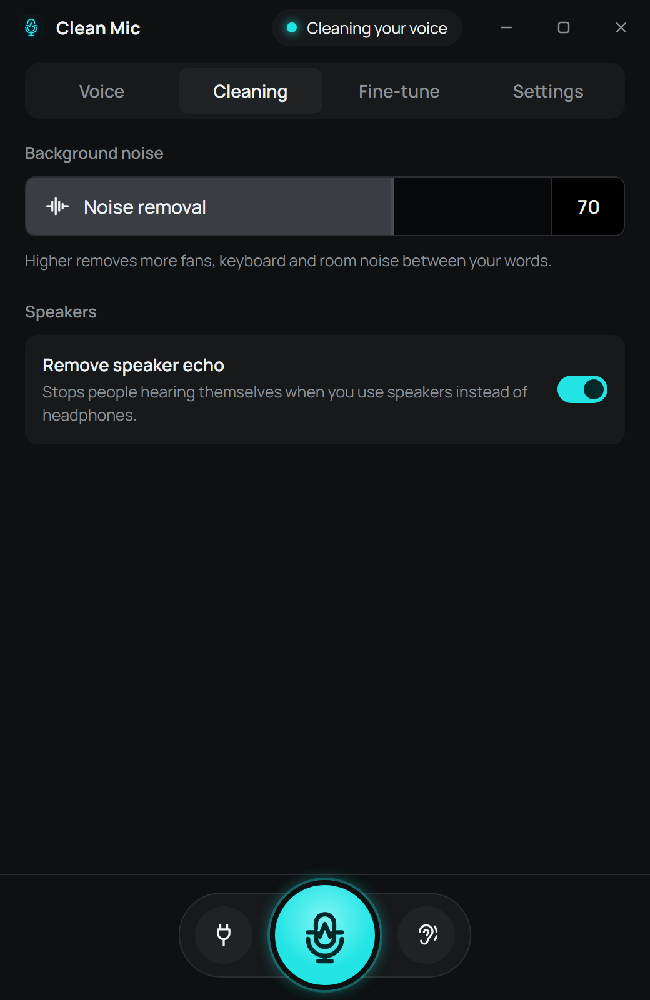
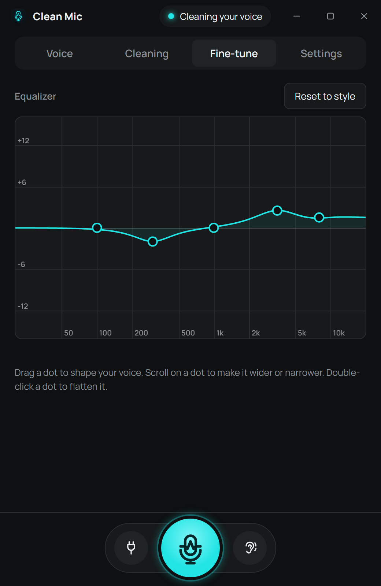
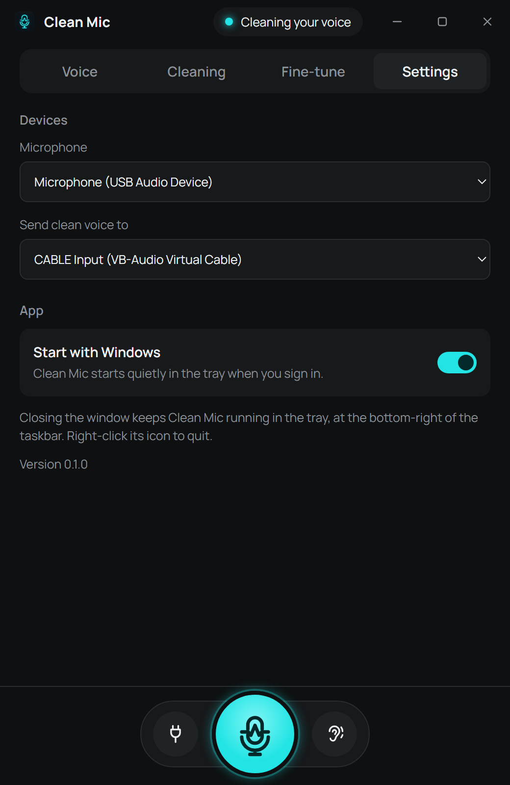

<p align="center">
  
</p>

<h1 align="center">Clean Mic</h1>

<p align="center">
  <b>Free, open-source AI noise cancellation for your microphone on Windows.</b><br />
  Remove background noise, keyboard clicks and echo from your mic in Discord, OBS, Zoom, Teams and games.<br />
  No account. No subscription. No special GPU. Runs 100% on your PC.
</p>

<p align="center">
  <a href="https://github.com/AmirPhenomenal/simple-clean-mic/releases/latest"></a>
  <a href="https://github.com/AmirPhenomenal/simple-clean-mic/releases"></a>
  
  <a href="LICENSE"></a>
</p>

<p align="center">
  <a href="https://github.com/AmirPhenomenal/simple-clean-mic/releases/latest"><b>⬇ Download Clean Mic for Windows</b></a>
  &nbsp;·&nbsp; <a href="#how-to-set-it-up">Setup</a>
  &nbsp;·&nbsp; <a href="#faq">FAQ</a>
  &nbsp;·&nbsp; <a href="ROADMAP.md">Roadmap</a>
  &nbsp;·&nbsp; <a href="#contributing">Contribute</a>
</p>

<p align="center">
  
</p>

---

Fans, keyboards, traffic, kids, a loud room, a cheap headset: **Clean Mic removes the noise
around your voice**, evens out your volume and makes sure you never clip, all in real time.
Your clean voice goes to a free virtual microphone ([VB-CABLE](https://vb-cable.com)), so any
app that lets you choose a microphone can use it.

It is made for **normal people**, not audio engineers: install it, pick **CABLE Output** as your
mic in Discord, and you're done. Every setting is one slider with a plain-English name.

## Features

- 🎙️ **AI noise removal.** Uses [RNNoise](https://jmvalin.ca/demo/rnnoise/), a neural network
  trained to separate voice from noise. Removes fans, AC, keyboard and mouse clicks, traffic,
  hum and room noise. One slider sets how strong it is.
- 🔇 **Voice gate.** Background sound is pushed down between your words and opens instantly
  when you speak.
- 🔊 **Automatic volume (AGC).** Whisper or shout, you come out at a steady, pleasant level.
- 🛡️ **Never clips.** A compressor and limiter catch shouts and laughs before they distort.
- 🔁 **Speaker-echo removal.** Using speakers instead of headphones? The WebRTC AEC3 echo
  canceller stops your friends hearing themselves.
- 🎚️ **Voice styles and EQ.** Natural, Warm, Crisp, Radio, Deep or Flat, plus Bass / Mid /
  Treble sliders and a drag-the-dots equalizer for fine-tuning.
- 🎧 **Hear myself.** Listen to your cleaned voice on your headphones.
- 🪶 **Light and low latency.** Native Rust audio engine (~30 ms buffer), small installer,
  works on any CPU. No NVIDIA RTX card needed.
- 🧭 **Set and forget.** Starts with Windows, lives in the tray, recovers when you unplug your
  mic, and updates itself.
- 🔒 **Private.** Audio never leaves your computer. No account, no telemetry, no internet needed
  (except for update checks).

## Screenshots

| Voice | Cleaning | Fine-tune | Settings |
| :---: | :---: | :---: | :---: |
|  |  |  |  |

## How to set it up

1. **Download** `Clean.Mic_x.y.z_x64-setup.exe` from the
   [latest release](https://github.com/AmirPhenomenal/simple-clean-mic/releases/latest) and run it.
2. The installer offers to install **VB-CABLE** (free virtual audio cable) if you don't have it.
   Say yes, then **restart your PC**.
3. In the app where you talk, choose **CABLE Output** as your microphone:
   - **Discord:** User Settings → Voice & Video → Input Device → *CABLE Output*.
     Tip: turn off Discord's own noise suppression (Krisp), Clean Mic already does it.
   - **OBS Studio:** Settings → Audio → Mic/Auxiliary Audio → *CABLE Output*.
   - **Zoom / Teams / Google Meet:** Audio settings → Microphone → *CABLE Output*.
   - **Games (Steam, Valorant, CS2, Fortnite, ...):** voice chat input device → *CABLE Output*.
     Or set *CABLE Output* as the Windows default recording device so every app uses it.

That's it. The status at the top of Clean Mic says **Cleaning your voice** while you talk.

> **Windows SmartScreen warning?** The installer isn't code-signed (certificates cost money every
> year), so Windows may say it "protected your PC". Click **More info → Run anyway**. All the
> source code is here, and every release is built from it by
> [GitHub Actions](.github/workflows/release.yml).

## Using it

| Tab | What it does |
| --- | --- |
| **Voice** | Mic level meters, voice style, voice volume and Bass / Mid / Treble. |
| **Cleaning** | How strongly background noise is removed, and speaker-echo removal. |
| **Fine-tune** | Equalizer: drag a dot to shape your voice, scroll on it to make it wider or narrower, double-click to flatten it. |
| **Settings** | Which microphone to use, where to send the clean voice, start with Windows. |

The buttons at the bottom:

- **Big mic button:** turn cleaning on or off. Off means others hear your raw mic.
- **Left button:** quickly switch microphones.
- **Ear button:** "Hear myself", play your clean voice on your headphones.

Closing the window keeps Clean Mic running in the tray (bottom-right of the taskbar).
Right-click the tray icon to turn cleaning off or quit.

## Clean Mic vs. other noise cancelling apps

| | **Clean Mic** | NVIDIA Broadcast | Krisp | Built into Discord / Zoom |
| --- | :---: | :---: | :---: | :---: |
| Price | **Free** | Free | Subscription | Free |
| Open source | **✅** | ❌ | ❌ | ❌ |
| Works on any PC (no RTX GPU) | **✅** | ❌ RTX only | ✅ | ✅ |
| Works in every app at once | **✅** | ✅ | ✅ | ❌ that app only |
| No account needed | **✅** | ✅ | ❌ | — |
| Speaker-echo removal | **✅** | ✅ | ✅ | varies |
| Voice styles + equalizer | **✅** | ❌ | ❌ | ❌ |

## FAQ

**How do I remove background noise from my microphone on Windows?**
Install Clean Mic, then select *CABLE Output* as the microphone in your app. Clean Mic removes
fans, keyboard and room noise in real time before anyone hears it.

**Is Clean Mic free?**
Yes, completely free and open source under the MIT license. No ads, no account, no trial.

**Does it work with Discord, OBS, Zoom, Teams, Skype, Steam and games?**
Yes. Anything that lets you pick a microphone works, because Clean Mic shows up as a normal
microphone (*CABLE Output*).

**Do I need an NVIDIA graphics card?**
No. Clean Mic runs on the CPU and works on any Windows 10/11 PC, laptops included.

**Is it a good free alternative to Krisp or NVIDIA RTX Voice / Broadcast?**
That's exactly what it's for: AI noise suppression, echo removal and automatic volume with no
subscription and no special hardware.

**Does it add delay to my voice?**
Very little. Audio is processed in 10 ms frames with a small (~30 ms) output buffer, which you
won't notice in calls or games.

**Does it record or upload my voice?**
No. Everything is processed in memory on your PC. Nothing is saved or sent anywhere.

**Others can't hear me. What's wrong?**
In your chat or game app, the microphone must be **CABLE Output** (not your real mic). In Clean
Mic → Settings, "Send clean voice to" should be **CABLE Input**.

**"CABLE Input" isn't in the list.**
VB-CABLE isn't installed yet, or Windows needs a restart after installing it. Clean Mic shows an
**Install VB-CABLE** button when it's missing.

**I hear an echo of myself.**
Turn off the ear button ("Hear myself") when you don't need it.

**"Remove speaker echo" says it's paused.**
It pauses while "Hear myself" is on, because it would remove your own voice. If it says
"not available", your speakers are the same device as the clean-voice output.

**I unplugged my mic / plugged in a new one.**
Clean Mic notices and restarts on its own.

**Mac or Linux?**
Windows only for now. The audio engine is cross-platform Rust, so ports are welcome: see
[Contributing](#contributing).

## How it works

```
mic ─► high-pass ─► AI denoise ─► echo removal ─► voice gate ─► auto volume ─► EQ ─► compressor ─► limiter ─► VB-CABLE
                     (RNNoise)      (AEC3)                                                                   └─► headphones (optional)
```

Audio is processed at 48 kHz in 10 ms frames on a dedicated real-time thread. The UI only sends
settings and reads level meters through lock-free atomics, so it can never stall your voice.

Built with [Tauri 2](https://tauri.app) (Rust + a plain HTML/JS interface),
[cpal](https://github.com/RustAudio/cpal) for audio devices (WASAPI),
[nnnoiseless](https://github.com/jneem/nnnoiseless) (RNNoise in Rust) and
[sonora](https://crates.io/crates/sonora) (WebRTC audio processing / AEC3).

## Contributing

Contributions are very welcome, from bug reports and translations to DSP work. Good places to start:

- Issues labeled [**good first issue**](https://github.com/AmirPhenomenal/simple-clean-mic/labels/good%20first%20issue)
  or [**help wanted**](https://github.com/AmirPhenomenal/simple-clean-mic/labels/help%20wanted).
- Ideas and questions in [Discussions](https://github.com/AmirPhenomenal/simple-clean-mic/discussions).
- Read [CONTRIBUTING.md](CONTRIBUTING.md) for setup and guidelines.
- See what's planned in the [roadmap](ROADMAP.md): VST/CLAP plugins, recording with timed
  transcripts, and a live transcript to text.

**If Clean Mic made your calls sound better, please ⭐ star the repo.** It helps other people
find it.

## Development

Needs [Rust](https://rustup.rs) (MSVC toolchain), Node.js 20+, and the Visual Studio Build Tools
("Desktop development with C++"). Build from PowerShell.

```powershell
npm install
npm run dev     # run the app
npm run build   # build the installer (src-tauri/target/release/bundle/nsis/)
cd src-tauri; cargo test --release   # DSP and echo-removal tests
```

The first `dev`/`build` downloads the VB-CABLE driver pack into `src-tauri/vbcable/`
(checksum-verified, not committed).

### Project layout

| Path | What's there |
| --- | --- |
| `src-tauri/src/dsp.rs` | The cleaning chain: filters, denoise, gate, auto gain, EQ, compressor, limiter. |
| `src-tauri/src/audio.rs` | Audio engine: devices, streams, resampling, echo removal. |
| `src-tauri/src/main.rs` | App shell: commands for the UI, tray, autostart, updater. |
| `ui/` | The interface (`index.html`, `main.js`, `style.css`). |
| `scripts/` | VB-CABLE download and release helper. |

### Releasing (maintainers)

```powershell
npm run release patch   # or minor / major / 1.2.3
git push --follow-tags
```

GitHub Actions runs the tests, builds and signs the installer, and creates a **draft** release
with `latest.json` for the auto-updater. Publish it to ship the update. The workflow needs the
`TAURI_SIGNING_PRIVATE_KEY` repo secret (contents of `~/.tauri/clean-mic.key`); its public key is
in `src-tauri/tauri.conf.json`. Keep the private key backed up: without it, installed copies can't
verify updates.

## Credits

- VB-CABLE is made by VB-Audio ([www.vb-cable.com](https://vb-cable.com)). It is donationware,
  all participations are welcome.
- [RNNoise](https://jmvalin.ca/demo/rnnoise/) by Jean-Marc Valin, via nnnoiseless.
- WebRTC audio processing (AEC3), via sonora.
- [Manrope](https://github.com/sharanda/manrope) font (SIL Open Font License).

## License

[MIT](LICENSE). Free for personal and commercial use.
